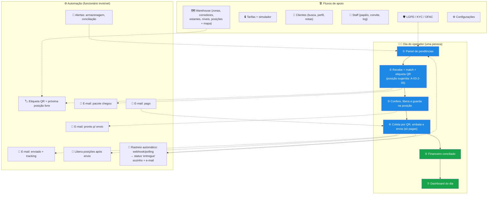

# Bufano Redirect — Fluxo do Back-Office (detalhamento para gerar imagem/diagrama via IA)

> **Objetivo deste documento:** descrever o fluxo completo do back-office (operação, financeiro, tarifas, clientes, staff, automação, relatórios) com detalhe suficiente para gerar um infográfico ou fluxograma numa IA de imagem — e também servir de base para a spec de implementação. Premissa central de design: **a empresa é pequena e uma única pessoa precisa conseguir operar tudo** — automação e painel de pendências são o coração do sistema, não um extra.

---

## 1. Princípio de design

```
        UMA PESSOA OPERA TUDO
                 │
   ┌─────────────┼─────────────┐
   ▼             ▼             ▼
AUTOMAÇÃO    PAINEL DE     FLUXOS DE
(e-mails,    PENDÊNCIAS    1 CLIQUE
alertas)     ("o que fazer (match, pagar,
             hoje")        enviar)
```

Tudo que puder ser automático é automático; o que exigir decisão humana aparece numa única fila de pendências; nenhuma ação rotineira deve exigir mais de 1-2 cliques.

---

## 2. O dia de trabalho do operador (fluxo principal — para o infográfico)

Jornada diária de UMA pessoa, em 7 momentos:

### ① Abre o painel de pendências ("o que precisa de ação hoje")
- **Ícone sugerido:** dashboard com sino de alerta e contadores
- **Conteúdo:** pacotes aguardando conferência, consolidações pagas sem envio, pedidos LGPD abertos, pacotes com armazenagem vencendo, pagamentos sem conciliação
- É a ÚNICA tela que precisa olhar para saber tudo

### ② Chegou mercadoria → recebe com match automático + etiqueta com QR code
- **Ícone sugerido:** caixa sendo escaneada + duas setas se encontrando (match) + etiqueta com QR code
- **Fluxo:** digita a suite (`BUF-10482`) ou o código de rastreio → sistema mostra o cliente E os pré-alertas pendentes dele → operador clica no pré-alerta correspondente → pesa, mede (C×L×A), tira foto → sistema **sugere automaticamente a próxima localização livre** do warehouse (ex.: `A-03-2-05`) → salva
- **Automático:** pré-alerta vira `matched`, cliente recebe e-mail "seu pacote chegou", e o sistema **gera a etiqueta de estoque para impressão** com:
  - **QR code** (aponta para o pacote no sistema — escanear abre a ficha direto no admin)
  - **Suite do cliente** em fonte grande (`BUF-10482`)
  - **Código de localização** legível a olho nu (`A-03-2-05`)
  - Data de recebimento + peso
- Operador cola a etiqueta na caixa e guarda na posição indicada — para achar depois, ou escaneia o QR ou lê o código de localização

### ③ Confere e libera
- **Ícone sugerido:** lupa sobre uma caixa + selo de aprovado
- **Fluxo:** marca `em análise` → inspeção (itens proibidos?) → `pronto para envio` OU `descartado` com motivo registrado
- **Automático:** cliente recebe e-mail "pacote pronto para envio"

### ④ Cliente pagou → embala e envia
- **Ícone sugerido:** caixa grande fechada com fita + etiqueta de envio + avião
- **Fluxo:** fila mostra consolidações **pagas** (nunca envia sem pagamento — conciliação automática garante) → sistema mostra a lista de itens **com a localização de cada um** (`A-03-2-05`, `B-01-1-02`...) em ordem de coleta → operador coleta escaneando o QR de cada pacote (confere que pegou o certo) → pesa a caixa final → cola etiqueta → digita o tracking → marca `enviado`
- **Automático:** cliente recebe e-mail com o código de rastreio; as posições dos pacotes coletados são liberadas no mapa do warehouse

### ⑤ Financeiro em ordem sem esforço
- **Ícone sugerido:** cifrão + check verde + planilha
- **Fluxo:** painel de pagamentos mostra tudo que entrou (Stripe automático); pagamento fora do sistema (PIX direto) é registrado manualmente em 1 clique; estorno se inicia pelo painel com motivo
- **Automático:** alerta se algo foi pago e não enviado, ou enviado sem pagar

### ⑥ Ajusta preços quando precisar
- **Ícone sugerido:** etiqueta de preço + controle deslizante
- **Fluxo:** tela de tarifas (zona, transportadora, preço/kg, taxa base, prazo) + taxas de serviço (consolidação, reembalagem, armazenagem/dia) + simulador "quanto ficaria?" antes de publicar

### ⑦ Fecha o dia com visão do negócio
- **Ícone sugerido:** gráfico de barras crescendo + calendário
- **Fluxo:** dashboard com receita do mês, envios por destino, pacotes recebidos/enviados, tempo médio no galpão

---

## 3. Fluxos de apoio (fora do dia a dia, mas essenciais)

### Cadastro do warehouse (localizações físicas)
- **Ícone sugerido:** planta baixa de galpão com grade de endereços
- **Endereçamento em 5 níveis (do maior para o menor):**

| Nível | Nome | Exemplo | Obrigatório? |
|---|---|---|---|
| 1 | **Zona** | `R` (recebimento), `G` (geral), `V` (volumosos), `Q` (quarentena/avariados) | Opcional — útil quando houver áreas distintas |
| 2 | **Corredor** | `A`, `B`, `C` | Sim |
| 3 | **Estante** | `01`, `02`, `03` | Sim |
| 4 | **Nível (prateleira)** | `1` (chão) a `4` (topo) | Sim |
| 5 | **Posição (bin)** | `01` a `10` | Sim — a "vaga" exata na prateleira |

- **Código resultante:** `A-03-2-05` (corredor A, estante 03, nível 2, posição 05) — curto, legível a olho nu, ordenável
- **Cadastro em massa:** operador define a estrutura uma vez ("corredores A-C, 4 estantes cada, 4 níveis, 10 posições") e o sistema gera todas as localizações de uma vez — não se cadastra vaga por vaga
- **Ocupação:** cada posição mostra livre/ocupada; o recebimento sempre sugere a próxima livre (mais perto da expedição primeiro); mapa visual de ocupação do galpão
- **Movimentação:** escaneou o QR → botão "mover para outra posição" (registra histórico de onde o pacote passou)
- **Regras automáticas:** pacote `descartado`/`enviado` libera a posição na hora; alerta se uma posição está ocupada há mais dias que o prazo de armazenagem grátis

### Gestão de clientes
- Busca por nome/e-mail/suite → perfil completo (pacotes, envios, pagamentos, LGPD, notas internas)
- Ações: suspender/reativar, reenviar confirmação de e-mail
- **Ícone sugerido:** cartão de perfil com lupa

### Gestão de staff (usuários do sistema)
- Promover/rebaixar papéis (customer ↔ ops/support/admin) pela tela, convite por e-mail, log de quem fez o quê
- **Ícone sugerido:** organograma pequeno com engrenagem

### Compliance (já existe, integra-se ao painel de pendências)
- Pedidos LGPD (exportação/exclusão) na fila de pendências; KYC/OFAC no perfil do cliente
- **Ícone sugerido:** escudo com cadeado

### Rastreamento automático (Correios / companhias aéreas) — previsão de integração
- **Ícone sugerido:** radar/antena + caminhão + avião com linha pontilhada de rastro
- **Realidade dos fornecedores:**
  - **Correios:** API oficial de rastreamento (CWS, exige contrato) — funciona por **consulta (polling)**, não envia webhook
  - **Companhias aéreas (carga):** rastreio por AWB, sem webhook direto para empresas pequenas
  - **Agregadores (AfterShip, 17TRACK, Ship24, TrackingMore, EasyPost):** monitoram Correios + centenas de carriers e **enviam webhook** a cada mudança — o caminho prático para operação enxuta
- **O que o sistema deixa pronto desde já (independe do fornecedor escolhido):**
  1. Tabela `tracking_events` — todo evento de rastreio (status bruto, status normalizado, data, origem, payload completo) ligado à consolidação
  2. Endpoint genérico `tracking-webhook` (Edge Function) — recebe de qualquer fornecedor, valida assinatura, grava o evento
  3. Mapa de normalização de status — "objeto entregue" (Correios) e "Delivered" (agregador) viram o mesmo status interno
  4. Polling de reserva (cron) para carriers sem webhook
- **Automático:** consolidação `enviada` → vira `entregue` sozinha quando o carrier confirma; cliente recebe e-mail; evento fora do padrão (extraviado, retido na alfândega) entra no painel de pendências
- **Cliente vê:** linha do tempo completa do rastreio na tela de envios (site e app), sem precisar ir ao site do Correios

### Configurações
- Dados da empresa, dias grátis de armazenagem, textos dos e-mails automáticos — tudo editável sem deploy
- **Ícone sugerido:** engrenagem

---

## 4. Mapa de status (as "cores" do sistema)

**Pacote:** `recebido` (cinza) → `em análise` (cinza) → `pronto` (verde) → `consolidando` (âmbar) → `enviado` (azul) | `descartado` (vermelho)

**Consolidação:** `pendente` (âmbar) → `paga` (azul-marca) → `enviada` (azul) → `entregue` (verde) | `cancelada` (vermelho)

**Pré-alerta:** `pendente` → `matched` (verde) | `cancelado`

**Pedido LGPD:** `pendente` → `em processamento` → `concluído` (verde) | `rejeitado`

---

## 5. E-mails automáticos (o "funcionário invisível")

| Gatilho | E-mail ao cliente |
|---|---|
| Pacote recebido no galpão | "Seu pacote da [loja] chegou! Peso: X kg" + foto |
| Pacote liberado | "Pronto para envio — monte sua caixa" |
| Pagamento confirmado | "Pagamento recebido — preparando seu envio" |
| Enviado | "A caminho! Rastreio: [código]" |
| Armazenagem vencendo | "Seu pacote está há X dias no galpão" |

---

## 6. Paleta (mesma do produto)

Navy `#0B1F3A` · Brand Blue `#1E88E5` · Off-white `#F5F7FA` · Verde `#16A34A` · Âmbar `amber-500` · Vermelho `red-600`

---

## 7. Prompts prontos para IA de geração de imagem

> **⚠️ Por que a imagem cortava antes:** o conteúdo todo (fluxo + warehouse + mapa de status + automação) é informação demais para UMA imagem — a IA tenta encaixar tudo e corta o que não cabe. A solução tem duas partes, já aplicadas nos prompts abaixo:
> 1. **Instruções anti-corte** no fim de cada prompt: formato explícito (retrato ou paisagem), margem de segurança e a ordem "tudo deve caber dentro do quadro, nada cortado nas bordas".
> 2. **Divisão em 3 imagens menores** (uma por prompt), em vez de uma imagem gigante. Gere uma de cada vez. Se ainda cortar, peça na sequência: *"Redraw the same image smaller, zoomed out, with everything fully inside the frame."*

### Imagem 1 de 3 — O dia do operador (fluxo principal)

> A clean, modern flat-design infographic, **vertical portrait format (2:3, e.g. 1024x1536)**, showing the daily workflow of a single warehouse operator running a US-to-Brazil package forwarding back-office called "Bufano Redirect". Vertical top-to-bottom flow with exactly 7 numbered stages in rounded cards, connected by arrows: (1) Morning dashboard — screen with alert bell and counter badges; (2) Receive package — box being scanned, arrows merging into a checkmark, printed label with QR code, suite "BUF-10482" and shelf code "A-03-2-05"; (3) Inspect and shelve — magnifying glass over a box, small shelf grid with one highlighted slot; (4) Pick, pack and ship — handheld scanner reading QR codes, sealed box with shipping label and small plane; (5) Finances reconciled — dollar sign with green check over a ledger; (6) Adjust pricing — price tag with slider; (7) End-of-day report — bar chart with calendar. Palette: navy #0B1F3A, blue #1E88E5, off-white background #F5F7FA, green #16A34A, amber accents. Minimalist vector style, rounded shapes, numbered badges. **Compact layout, zoomed out, at least 5% empty margin on all four sides, every element fully visible inside the canvas — nothing cropped or touching the edges.**

### Imagem 2 de 3 — Warehouse: etiqueta QR e localização

> A clean flat-design infographic, **horizontal landscape format (3:2, e.g. 1536x1024)**, split into two halves, for a package forwarding warehouse system. LEFT half: a large printed stock label mock-up showing a big QR code, the suite number "BUF-10482" in bold, the location code "A-03-2-05", and small lines for date and weight. RIGHT half: a simplified warehouse floor plan seen from the front — 3 aisles labeled A, B, C, each with shelving racks divided into numbered levels and bins; one bin highlighted in bright blue with a pin marker, matching the label's code "A-03-2-05"; a small legend showing green = free slot, amber = occupied. Palette: navy #0B1F3A, blue #1E88E5, off-white #F5F7FA, green #16A34A, amber. Minimalist vector style. **Compact layout, at least 5% empty margin on all sides, everything fully inside the frame — nothing cropped.**

### Imagem 3 de 3 — Automação e mapa de status

> A clean flat-design infographic, **horizontal landscape format (3:2, e.g. 1536x1024)**, split into two stacked rows, for a logistics back-office. TOP row titled area: an "invisible employee" concept — a robot/gear icon in the center sending 5 small emails to a customer avatar, each email icon labeled only with a tiny pictogram: box arrived, ready to ship, payment check, plane with tracking, clock for storage warning. BOTTOM row: two horizontal status pipelines shown as connected pill-shaped badges — pipeline 1 (package): gray → gray → green → amber → blue, with a red badge branching off; pipeline 2 (shipment): amber → blue → blue → green, with a red badge branching off. No long text, only short one-word labels. Palette: navy #0B1F3A, blue #1E88E5, off-white #F5F7FA, green #16A34A, amber, red. Minimalist vector style. **Compact layout, at least 5% empty margin on all sides, everything fully inside the frame — nothing cropped.**

### Fluxograma técnico (documentação — opcional, gerar separado)

> A technical flowchart, **horizontal landscape format (16:9)**, with four swim lanes labeled "Automation", "Operator", "Customer", "System of Record". Operator lane: Open pending-tasks dashboard → Receive package (enter suite → pick matching pre-alert → weigh, measure, photo) → System assigns free warehouse slot and prints QR label ("A-03-2-05") → Shelve package → Inspect (approve or discard) → Pick paid consolidation items by scanning QR codes at their shelf locations → Pack → Enter tracking → Mark shipped. Automation lane (dashed arrows firing from operator actions): suggest next free warehouse slot, generate QR stock label, send lifecycle emails (arrived / ready / paid / shipped with tracking), free up shelf slots after shipping, raise storage-overdue alerts, reconcile payments vs shipments. Customer lane: receives emails, pays via Stripe checkout. System of Record lane: database with row-level security storing packages, warehouse locations (zone-aisle-rack-level-bin), consolidations, payments, rates, roles, audit log. Flat vector style, rounded rectangles, blue #1E88E5 arrows, navy #0B1F3A text, off-white #F5F7FA background. **Keep node text short (max 4 words per node), compact layout, 5% margin on all sides, all lanes and nodes fully inside the frame — nothing cropped.**

---

## 8. Diagrama Mermaid (renderizável nesta sessão)


